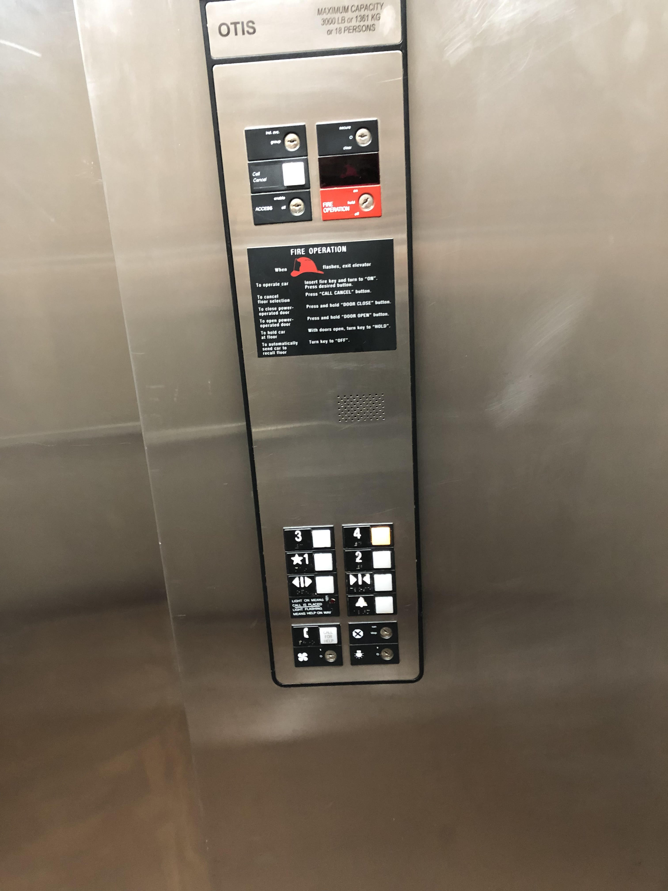

# ElevatorHomework
This is my Homework1 Project for "Computer Human Interaction" class, it uses Processing Language

For C:

This elevator was found at uPointe apartments

gif of elevator interaction

Issues with current design and reasons it is bad:
 
 I think the issues with this design is how small the buttons are compared to the size of the frame for the buttons. I would have made the buttons take up the whole panel instead of just the bottom 25%. I also don’t like that the buttons for the levels and the buttons for the emergency call look the same. I would’ve distinguished the difference with a difference of color. These are the reasons why I think the current design is bad.
 
 For B:
 
 Common Uses and Rare Uses:
 
  The over arching most common use for an elevator is to get from point A to point B. A and B are also directly either above or below each other. A lot of people use elevators to avoid having to use stairs. They are less commonly known for being a means of transportation for objects. Big skyscrapers use elevators to transfer heavy objects that humans couldn’t care up and down. 
  
 Common Sequence:
  
  The common sequence of actions is just simply pressing the button of the floor you want to go to, and sometimes, if it taking a while pressing the close door button. . The elevator supports the uneducated user by simply giving it one option (split up into a few choices) the users only real option is to click a floor number and I’m sure it’s pretty self-explanatory what that will do. 
 
 Providing feedback:
 
  The elevator I choose to use did not provide feedback by itself, it sorts of gave feedback involuntarily when I felt myself go up and down. 
 
 Common Mistakes:
 
  I feel like the only common mistake with this design is that the open and close door buttons are not immediately obvious as to what they do. It could be made clearer. 
 
 Improvements:
 
  I suggest moving the buttons up some, making them bigger, and clearing up the open and close buttons
 
 Sketched new Solution:
 
 
 
 For A:
 
Interactive Processing Version:

 
 
